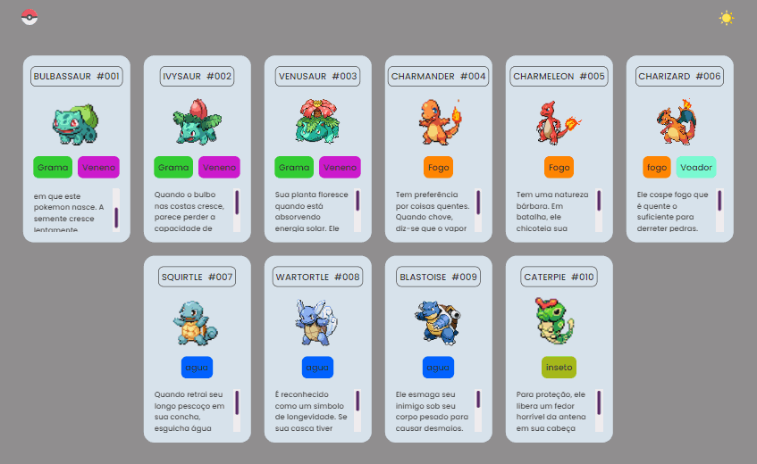

# Pokedex



## Propósito

O projeto Pokédex tem um significado especial, pois marca o meu primeiro passo no mundo do desenvolvimento. Foi através dele que descobri minha paixão por programação e encontrei a certeza de que essa era a carreira que desejava seguir. O propósito central deste projeto é não apenas fornecer uma experiência envolvente para os amantes de Pokémon, mas também demonstrar a força de vontade e dedicação necessárias para iniciar essa jornada emocionante.

## Funcionalidades

1. **Visualização de Cards Pokémon:**

   - Os usuários podem explorar uma variedade de cards contendo informações detalhadas sobre diferentes Pokémon.

2. **Troca de Tema:**

   - Implementação de um botão que permite aos usuários alternar entre temas, proporcionando uma experiência visual personalizada.

3. **Responsividade:**

   - O projeto é desenvolvido com um design responsivo, adaptando-se harmoniosamente a telas de diferentes tamanhos, desde dispositivos móveis até monitores desktop.
   
3. **Interatividade Dinâmica:**

   - Os cards de Pokémon são interativos, permitindo aos usuários utilizar o scroll do mouse para obter informações adicionais.
    
## Ferramentas utilizadas

1. **HTML:**
   -  Estruturação do conteúdo.

2. **CSS:**
   - Estilização e apresentação visual.

3. **JavaScript:**
   - Lógica de validação e interatividade.

## Decisões de Projeto

1. **Separação de Responsabilidades em Arquivos:**
   - Mantive a separação de arquivos CSS para a melhor organização dos estilos e facilitar o desenvolvimento do projeto. Os arquivos CSS estão estruturados de acordo com a função e escopo, seguindo um padrão de nomenclatura claro.

   - A separação em pastas também foi uma decisão tomada a fim de manter a organização.

## Como utilizar

1. Clone o repositório:

    ```bash
    git clone https://github.com/Paulo-Heber/Pokedex.git
    ```

2. Abra a pasta do projeto e dê dois cliques sobre o arquivo index.html.


